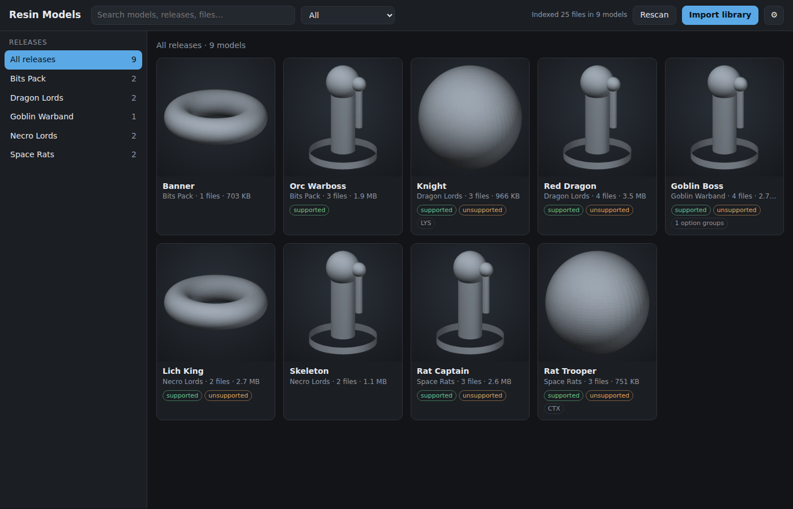
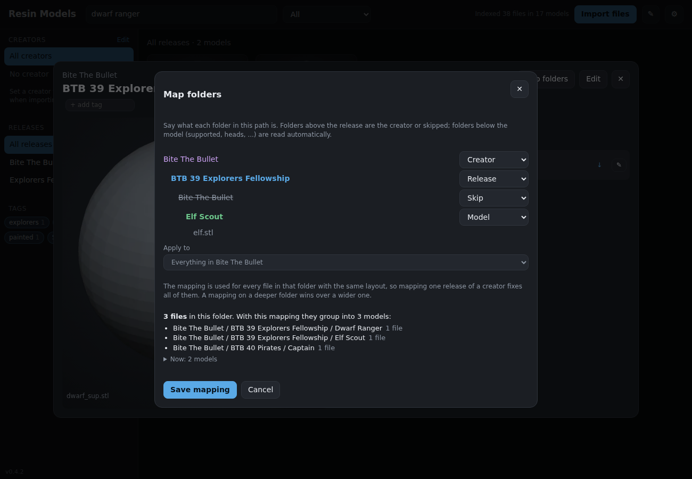
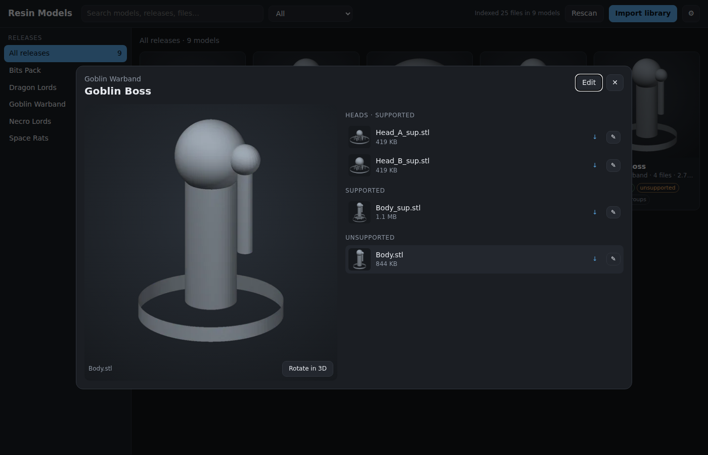

# Resin Model Manager

A small self-hosted web app for a resin printing library. It indexes STL, LYS and
CTX files (also CTB, OBJ, 3MF), including files inside `.zip` and `.7z` archives,
groups them by **release** and **model**, separates **supported** and
**unsupported** versions, and shows rendered previews of the STLs.



## How it works

* **Import files from the browser.** Click *Import files*, or drop files,
  folders or `.zip` / `.7z` archives anywhere on the page. They are uploaded
  into the app's library folder and indexed straight away. Archives stay
  archived, so you keep the space savings. Optionally pick a folder to put them
  in (usually the release name); otherwise each archive or folder becomes its
  own release. A file that is already there with the same size is skipped; a
  different file with the same name is kept under a numbered name. If an
  existing library on the NAS is set as `SOURCE_PATH` (mounted read-only), the Import
  dialog can also copy it in; the originals are never changed.
* **Grouping.** Each file's path is read with archives treated as folders
  (`Release/Heroes.zip` → `Release/Heroes/...`). Files imported in the browser
  are read as `Release/Model/...`, or filed as `Creator/Release/Model/...` when
  you give a creator in the Import dialog. A library copied from a NAS folder
  follows *Layout of the copied NAS folder* in Settings (set it to
  `Creator / Release / Model` if that is how you keep it). Each top-level
  folder remembers how it arrived, so both kinds group correctly side by side. The first
  meaningful folder below it is the model; folders like `Supported`, `STL`,
  `32mm`, `Lychee` or `<Model> Presupported` are skipped as noise. So is a folder that repeats
  a creator's name inside a release (`Creator/Release/Creator/Model`), once
  that creator is known from the folder layout, *Set creator* or the Import dialog.
  Top-level folders listed under *Folders that are not creators* in Settings
  (default `Freebies`) are skipped too: inside one, a folder named after a known
  creator is the creator, anything else is a release. Deeper
  folders such as `Heads` or `Weapon options` become option groups. Loose files
  are grouped by their shared name prefix (`Orc_Warboss_Body.stl` +
  `Orc_Warboss_Axe.stl` → *Orc Warboss*).
* **Supported / unsupported** comes from folder and file names (`supported`,
  `presupported`, `pre-supp`, `_sup`, `unsupported`, `no supports`, ...). A
  file with no supported marker in its name or any parent folder counts as
  unsupported.
* **Folder mappings.** When a creator's folders don't fit the automatic guess,
  open one of their models and click *Map folders*. The file's path is shown one
  folder per line; mark each folder as Creator, Release, Model or Skip (folders
  below the model, like `Supported` or `Heads`, are still read automatically),
  and pick which folder the mapping applies to, usually the creator's folder. A
  preview shows how the files in it will group before you save. Every file in
  that folder with the same layout is then read that way, so one mapping fixes
  all of a creator's releases. A mapping on a deeper folder wins over a wider
  one; corrections below still apply on top, and tags follow the regrouped
  models. Mappings are listed (and deleted) under ✎ Corrections.

  
* **Corrections.** The guesses will sometimes be wrong. *Edit* on a model renames
  it or moves it to another release (renaming onto an existing model merges
  them); ✎ on a file changes its support flag, model, release or option group,
  for just that file or for a whole folder. Corrections are stored as rules on
  the path, survive new imports, and can be removed under ✎. No files are renamed.
* **Editing several models at once.** Click *Select models*, tick models (in
  one release or several; *Select all shown* picks the whole grid), then *Edit…*
  to add or remove tags, move them to another release, set their creator or
  support, or hide them, all in one go.
* **Combining models.** Some releases are one model split into modular parts
  that got read as separate models (Head, Body, Arms). Click *Select models*,
  tick the parts, then *Combine…* and name the combined model; each
  former model becomes an option group of it (Head, Body, Arms), and their tags
  carry over. The combine survives new imports, can be renamed from *Edit*, and
  is undone with *Split apart* on the model or under ✎ Corrections.
* **Tags.** Add tags on a model's page (type and press Enter; existing tags are
  suggested). With a release selected, *Tag all models in this release* adds or
  removes tags on every model in it at once. Click tags in the sidebar to filter
  (several tags = models that have all of them). The search box also matches
  tags; `tag:painted` matches that tag exactly. Tags follow a model when you
  rename or merge it.
* **Creators.** With a release selected, *Set creator* names who made it (or
  use the Creator field in a model's *Edit* form, which sets it for that model's release). *Edit*
  next to Creators in the sidebar sets the creator of many releases at once
  (filter the list, tick releases, save). The Import dialog has an optional
  Creator field: uploads with a creator go into that creator's folder in the
  library, next to their other releases. Click a creator in the sidebar to
  browse only their releases; the search box matches creators too. With the
  *Creator / Release* folder setting, the creator folder is used until you set
  one. Creators are kept when the library is re-indexed; save a blank creator
  to go back to the folder guess. *No creator* at the top of the Creators list
  shows the releases still missing one: setting a creator there moves straight
  on to the next, and *Set creator for several* lists only those releases.
  If a creator's name shows up oddly (a folder or account name like
  `the-printing-goes-ever-on`), click the creator and use *Rename creator*: the
  new name is used for their releases and MyMiniFactory items, and kept across
  re-indexing and syncs. *Undo renames* goes back to the original name. When
  the name comes from a folder, the dialog can rename that folder in the
  library too; tags, corrections and previews move with it. Only the library
  copy is renamed, and copying from the NAS folder again uses the new name.
* **Previews.** STLs are rendered by a built-in CPU renderer (numpy, no GPU or
  OpenGL needed) and cached as WebP images in `data/previews`. Files inside
  archives are rendered straight from the archive without extracting them into
  the library; 7z archives are unpacked once into `data/tmp` per batch and
  cleaned up. Previews render in the background after an import (model covers
  first), and on demand when you open something not rendered yet. For LYS/CTX
  files the app shows an embedded thumbnail when the file has one.
* **Bundled preview images.** JPG, PNG, WebP, GIF and BMP images that come
  with a release or model (loose, or inside its `.zip` / `.7z`) are indexed and
  shown before rendered STL previews. An image inside a model's folder belongs
  to that model. Otherwise an image whose name, or a folder it sits in, names a
  model belongs to it, even with extra words around the name
  (`Knight_front.jpg`, `DL_RedDragon_Promo.jpg`, `Images/Knight/01.jpg`,
  `02_rat_trooper_painted.png`). Anything else is a release image, shown above
  the models when the release is selected; in a release with only one model it
  is also that model's cover. Images named `cover`, `main`, `promo` or
  `preview` are picked first. If an image lands in the wrong place, open it and
  pick the model it belongs to (or *Whole release*) under *Belongs to*; this is
  saved as a correction rule.
  In a model's image list, ☆ makes an image the model's main image (shown on
  its card and first in its window), and *Release* makes it the release's main
  image (shown first, larger, above the release's models). Click again to undo.
  The ☆ next to a file does the same with that file's rendered preview, so one
  option or part can be the model's main image.
  These choices are kept across re-indexing.
* **3D view.** *Rotate in 3D* loads the STL in the browser with three.js (this
  needs internet access from the browser, not from the NAS).
* **Your MyMiniFactory library.** MyMiniFactory has no API for a user's
  purchases, pledges or tribes, so *Sync* (next to MyMiniFactory in the sidebar)
  gives you a bookmark to drag to your bookmarks bar. Click it on
  myminifactory.com while logged in: it reads your library the way the site's
  own Library page does and sends the list to a Resin Models window it opens.
  That covers purchases, pledges, tribes, creator groups, MMF+ and free
  downloads. Items are listed with their images, creator, the release they came
  in (tribe month, campaign, group or MMF+ release) and a link to
  MyMiniFactory, and open in the model window like your own models. MyMiniFactory
  only lets your browser download the files, so the window has *Download on
  MyMiniFactory* and *Import the download…*, which opens Import files with the
  item as the release and its creator filled in. Your
  MyMiniFactory login is never stored by the app. The first time the bookmark
  sees an item it also reads all its listing images in full size and its
  published date from MyMiniFactory (the library list only has one or two
  images; a big first sync reads 400 items per run). Items whose name shares
  its words with a local release or model (by the same creator, or a close
  match by anyone) are marked *in your library*. The rest show up in the grid
  like any other model, ahead of your own models: newest published first, then
  any without a date by name, then your library by release and model. They're found by search and by the
  Creators and Releases filters. The MyMiniFactory section of the sidebar
  filters them: *Only MyMiniFactory*, *Not in your library* or *Hide
  MyMiniFactory* (click again to show everything). Their MyMiniFactory tags
  come along: they show on the items and work in the tag filter and in
  `tag:` searches like your own tags. You can add tags of your own to an item
  too: in its window, with *Select models* → *Edit…* (MyMiniFactory items can be
  picked along with your models; only their tags change) or with *Tag release*. A model in your library that matches an
  item gets the item's tags too, shown with a dashed outline; they aren't
  stored on the model, so they can't be removed there. MyMiniFactory creators are
  added to the Creators list, merged with
  your own creators when the names only differ in spaces, capitals, special
  characters or words like "Miniatures" ("CobraMode" is "Cobra Mode"). If the
  bookmark can't reach the Resin Models window it saves `myminifactory-library.json` instead, which you
  upload in the same dialog. This relies on MyMiniFactory's website, not a
  supported API, so a site change can break it. A month after the last sync
  the app shows a reminder to sync again, with *Sync now* and *Dismiss* (which
  hides it until the next sync); the number of days is in Settings, and 0
  turns it off.



## Running on the NAS

GitHub Actions builds the image on every push to `main` and publishes it as
`ghcr.io/jrud52/resin-model-manager:latest` (amd64 and arm64). Nothing in
`docker-compose.yml` needs editing: folder paths, user and port come from
environment variables, and everything else is in the app under ⚙ Settings.

The first time the workflow runs, GitHub creates the package as private. Make
it public once (GitHub → your profile → **Packages** → `resin-model-manager` →
**Package settings** → **Change visibility**) so the NAS can pull it without a
login.

| Variable | Default | Meaning |
| --- | --- | --- |
| `DATA_PATH` | `/volume1/docker/resin-manager` | The app's own data: database, settings and preview images. Create it first. |
| `LIBRARY_PATH` | `/volume1/3d-library` | Your model files. Everything you import is copied here. Create it first; it can be on a different share from `DATA_PATH`. |
| `PUID` / `PGID` | `1000` | Your NAS user (`id -u`, `id -g`), so copied files belong to you. |
| `PORT` | `8417` | Port on the NAS. |
| `SOURCE_PATH` | *(none)* | Optional. An existing library on the NAS, mounted read-only so the Import dialog can copy it in. Leave it out to start from an empty library. |

### With Portainer (auto-updates from Git)

1. **Stacks → Add stack → Repository.** Repository URL
   `https://github.com/JRud52/resin-model-manager`, reference `refs/heads/main`,
   compose path `docker-compose.yml`.
2. Under **Environment variables**, add `DATA_PATH`, `LIBRARY_PATH`, `PUID` and `PGID`, plus
   `SOURCE_PATH` if you have an existing library to bring in (and `PORT` if
   8417 is taken).
3. Turn on **GitOps updates**, mechanism **Polling** (e.g. every `5m`), and turn
   on **Re-pull image** and **Force redeployment**. Force redeployment makes
   every poll pull the image even when the repo has no new commit, so an image
   that finishes building a few minutes after the commit is still picked up.
   The container is only recreated when the image actually changed.
4. **Deploy the stack**, open `http://<nas>:8417` and click **Import files**.

Don't use a compose file with a `build:` section in Portainer: it builds once
and then keeps reusing the old image on updates.

### With docker compose

1. Copy `docker-compose.yml` and `.env.example` to the NAS, rename the latter to
   `.env` and fill in your paths and IDs.
2. `docker compose up -d`, then open `http://<nas>:8417`.
3. Update later with `docker compose pull && docker compose up -d`.

To build the image yourself instead of pulling it, run
`docker compose -f docker-compose.yml -f docker-compose.build.yml up -d --build`
from a checkout.

### First run

Click **Import files** (or drop files on the page). Indexing progress shows in
the header. Rendering previews for a large library takes a while the first
time; after that they come from the cache.

To copy in an existing library that is already on the NAS instead of
uploading it, set `SOURCE_PATH`. The Import dialog then shows *Copy from NAS
folder*.

### Settings

The ⚙ button in the header holds the rest: the layout of a library copied
from the NAS folder (`Release/...` or `Creator/Release/...`; browser imports
don't use it), your preferred file format and supported/unsupported version
(the model window shows only those by default, with buttons to switch to the
others; models without them show what they have), background rendering,
render threads, preview size, the preview size limit and how many days after
the last MyMiniFactory sync to remind you to sync again. They are saved in the
database, so they survive updates. Changing the folder setting regroups the
library; changing the preview size re-renders the previews.

The old environment variables (`RELEASE_DEPTH`, `PREVIEW_WORKERS`, `PRERENDER`,
`PREVIEW_SIZE`, `MAX_PREVIEW_MB`) still work as
defaults until a value is saved in the app.

## Limits

* RAR archives and archives nested inside archives are not read.
* LYS/CTX files only get a preview if they contain an embedded image.
* Password-protected archives are skipped (shown as errors in the server log).

## Development

```sh
pip install -r requirements.txt
python tests/make_sample_library.py /tmp/rmm/src
SOURCE_DIR=/tmp/rmm/src LIBRARY_DIR=/tmp/rmm/lib DATA_DIR=/tmp/rmm/data uvicorn app.main:app --port 8417
python tests/smoke_test.py http://localhost:8417 /tmp/rmm/src
pip install playwright && python tests/mmf_test.py http://localhost:8417  # MyMiniFactory sync on a fake site
```

Stack: Python 3.12, FastAPI, SQLite, numpy + Pillow renderer, py7zr; plain
HTML/JS front end with no build step.

## License

MIT, see [LICENSE](LICENSE).
